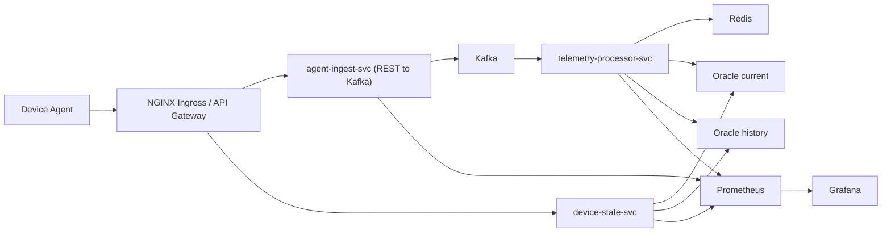

# Architecture

The Telemetry Platform simulates a modern endpoint-monitoring system.  
It is built as a **microservices architecture** using Java 21 and Spring Boot 3, deployed on Kubernetes, with Kafka for messaging and Oracle DB for persistence.

---

## 1. System Overview

The platform collects telemetry data (CPU, memory, disk, process list, etc.) from distributed device agents.  
Each agent periodically posts telemetry via REST; the data is normalized, streamed through Kafka, stored in Oracle for historical analysis, and exposed via REST APIs for operators or dashboards.

This design showcases:

- Reactive, asynchronous message flow through **Kafka**  
- Stateless ingestion and scalable processing  
- Deployment orchestration via **Kubernetes + Helm**  
- Distributed coordination with **Redis**  
- Observability using **Prometheus + Grafana**  
- CI/CD and documentation as code via GitHub Actions + MkDocs

---

## 2. High-Level Architecture Diagram

---

## 3. Component Breakdown

### agent-ingest-svc

Entry point for telemetry ingestion.

- Exposes `POST /telemetry`.
- Stateless Spring Boot 3 REST app producing to Kafka.
- Scales horizontally behind NGINX ingress.

### telemetry-processor-svc

Consumes `telemetry.raw` from Kafka.

- Normalizes and validates messages.
- Uses Redis for throttling and deduplication.
- Writes to Oracle tables: `device_status_current` and `device_status_history`.
- Publishes compacted topic `telemetry.latest` and append-only `telemetry.timeseries`.

### device-state-svc

Exposes device state via REST (`/devices/{id}/status`, `/history`).

- Reads Oracle tables; optional Redis cache.
- Provides JSON APIs for operators or dashboards.

### Redis

Distributed cache for deduplication and throttling windows.

- Future: read caching and API-level rate limiting.

### Kafka

Backbone of event-driven communication.

- Topics: `telemetry.raw`, `telemetry.latest`, `telemetry.timeseries`.
- Schema Registry added in Release 4.

### Oracle DB

Stores processed telemetry.

- `device_status_current` – one record per device.
- `device_status_history` – append-only time series.
- Indexed by `(device_id, timestamp)`.

### NGINX Ingress / API Gateway

Routes traffic to backend services.

- Provides load balancing and TLS termination.
- Adds authentication headers from Release 5 onward.

---

## 4. Data Flow Summary

1. Device posts telemetry → agent-ingest-svc.
2. agent-ingest-svc produces `telemetry.raw` to Kafka.
3. telemetry-processor-svc consumes, throttles, writes to Oracle.
4. device-state-svc exposes results via REST.
5. Prometheus/Grafana collect runtime metrics.

---

## 5. Scalability & Resilience

- **agent-ingest-svc** scales via Kubernetes HPA.
- **Kafka** absorbs load spikes; decouples ingestion from processing.
- **Redis** prevents overload through throttling.
- Health and metrics exposed via Actuator endpoints.
- Rolling upgrades handled via Helm charts.
- Integration tests validate pipelines with Testcontainers.

---

## 6. Release Evolution

| Release | Key Additions |
|---------|---------------|
| R1 | Basic REST ingestion → Oracle direct |
| R2 | Introduced Kafka + telemetry-processor-svc |
| R3 | Added Redis throttling + history |
| R4 | Added Schema Registry + Debezium CDC |
| R5 | API-key auth + complete observability |
